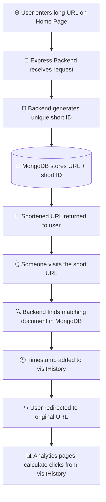
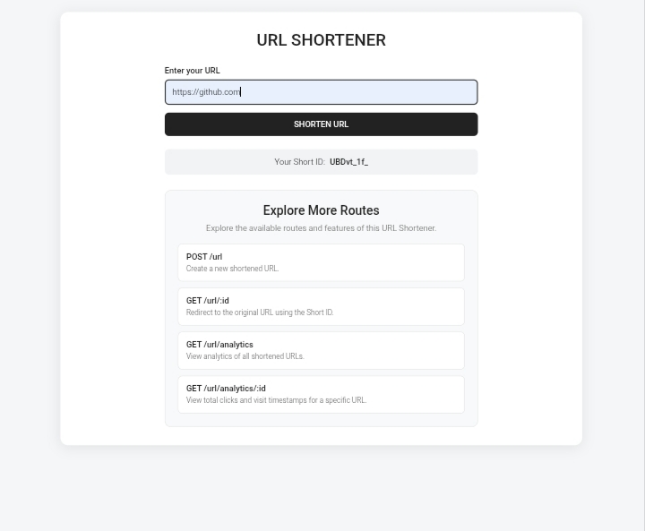
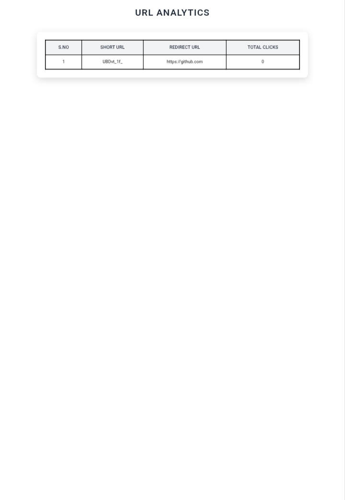
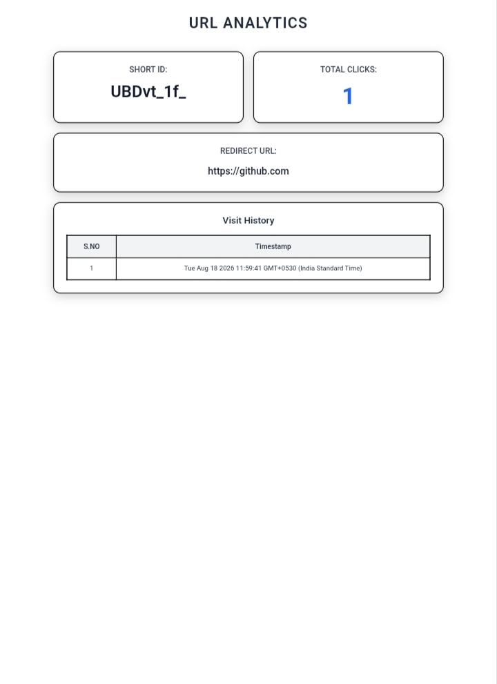
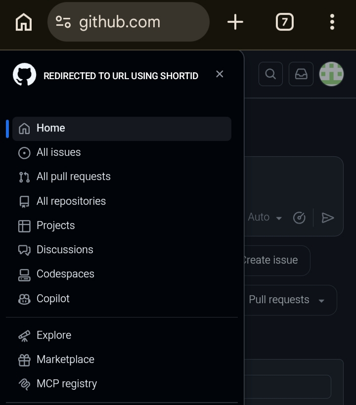

<div align="center">

# 🔗 URL Shortener

### A Full-Stack Link Shortening Service with Visit Tracking & Analytics

**Built with Node.js, Express.js, EJS, MongoDB Atlas & Mongoose**

<br/>


<br/>

[](https://nodejs.org/)
[](https://expressjs.com/)
[](https://www.mongodb.com/atlas)
[](https://mongoosejs.com/)
[](https://ejs.co/)
[](https://render.com/)

<br/>

[](#-live-demo)
[](#-contributing-guide)
[](#)

<br/>

**[🔴 Live Demo](https://url-shortner-5lk9.onrender.com)** • **[📂 Source Code](https://github.com/manisaimuralithatipelli/Web-development-/tree/main/URL%20Shortener)** • **[📖 Route Docs](#-route-documentation)** • **[📸 Screenshots](#-screenshots)**

</div>

---

## 📌 Introduction

**URL Shortener** is a full-stack web application that converts long, unwieldy URLs into short, shareable links. When a shortened link is visited, the application automatically redirects the visitor to the original URL — while quietly recording that visit for later analysis.

Beyond simple redirection, the project includes a built-in **analytics system**: every visit is timestamped and stored, so the app can show total click counts and a full visit history for each shortened link.

This project was built to understand how a server-rendered **EJS frontend** communicates with a **Node.js/Express backend** and a **MongoDB database**, and to build a practical, real-world backend project centered around URL redirection and analytics.

> 💡 **Tip:** If you're new to backend development, the [Application Flow](#-application-flow) and [Database Model](#-database-model) sections explain exactly how a link goes from "submitted" to "shortened" to "tracked."

---

## 📚 Table of Contents

1. [About the Project](#-about-the-project)
2. [Features](#-features)
3. [Tech Stack](#-tech-stack)
4. [Folder Structure](#-folder-structure)
5. [Database Model](#-database-model)
6. [Route Documentation](#-route-documentation)
7. [Frontend Pages](#-frontend-pages)
8. [Styling](#-styling)
9. [Application Flow](#-application-flow)
10. [Environment Variables](#-environment-variables)
11. [Running Locally](#-running-locally)
12. [Deployment Guide](#-deployment-guide)
13. [Live Demo](#-live-demo)
14. [Security Notes](#-security-notes)
15. [Screenshots](#-screenshots)
16. [What This Project Demonstrates](#-what-this-project-demonstrates)
17. [Contributing Guide](#-contributing-guide)
18. [Author](#-author)
19. [Contact](#-contact)
20. [GitHub Stats](#-github-stats)
21. [Star This Repository](#-star-this-repository)

---

## 📖 About the Project

The **URL Shortener** lets a user paste any long URL into a form on the home page and receive back a short, unique link. Visiting that short link redirects the browser straight to the original destination — the same core mechanic used by services like Bitly or TinyURL.

What makes this project more than a basic redirector is its **analytics layer**: every time a shortened link is visited, a timestamp is appended to that link's visit history in MongoDB. From this history, the app derives:

- 📊 **Total clicks** — the number of times a link has been visited
- 🕒 **Individual visit timestamps** — exactly when each visit happened

All of this is rendered server-side using **EJS templates**, meaning the HTML pages are generated on the backend and sent fully formed to the browser — no client-side framework involved.

---

## ✨ Features

- ✅ Shorten any long URL into a unique short link
- ✅ Automatic redirection from the short link to the original URL
- ✅ Visit tracking with timestamped history, stored in MongoDB
- ✅ Analytics page listing all shortened URLs with total clicks
- ✅ Detailed analytics page per URL, showing every visit timestamp
- ✅ Server-rendered EJS frontend (no separate frontend framework)
- ✅ Environment-based configuration with `dotenv`
- ✅ Responsive styling for smaller screens
- ✅ Live deployment on Render

---

## 🛠 Tech Stack

<div align="center">

| Layer | Technology | Purpose |
|---|---|---|
| 🖥️ Frontend | **HTML, CSS, EJS** | Renders server-side pages for the home, analytics, and detail views |
| ⚡ Backend Framework | **Express.js** | Handles routing, requests, and responses |
| 🟢 Runtime | **Node.js** | Runs JavaScript on the server |
| 🍃 Database | **MongoDB / MongoDB Atlas** | Stores shortened URLs and their visit history |
| 🔐 Config | **dotenv** | Loads the MongoDB connection string from environment variables |
| ☁️ Hosting | **Render** | Deploys and hosts the live application |
| 🔧 Version Control | **Git & GitHub** | Tracks changes and hosts the source code |

</div>


---

## 📂 Folder Structure

```
URL Shortener/
├── app.js
├── package.json
├── package-lock.json
│
├── models/
│   └── url.js
│
├── routes/
│   └── route.js
│
├── views/
│   ├── home.ejs
│   ├── analytics.ejs
│   └── analyticsid.ejs
│
├── public/
│   └── css/
│       ├── style.css
│       ├── analytics.css
│       └── analyticsid.css
│
└── Screenshots/
    ├── Analyticsid.jpg
    ├── analytics.jpg
    ├── home.jpg
    └── redirectUrl.jpg
```

### What each part does

| Path | Purpose |
|---|---|
| `app.js` | Main Express application — middleware setup, MongoDB connection, route mounting, home page rendering, and server startup |
| `models/url.js` | Mongoose model defining the schema for a shortened URL |
| `routes/route.js` | Handles URL creation, redirection, and analytics routes |
| `views/` | EJS templates that render the frontend pages |
| `public/css/` | Stylesheets for the home, analytics, and analytics-detail pages |
| `Screenshots/` | Screenshots demonstrating the application's UI and functionality |
| `package.json` | Project dependencies and the start script |
| `package-lock.json` | Locked dependency versions |

---

## 🗄 Database Model

Shortened URLs are stored in MongoDB using a Mongoose model (`models/url.js`) with the following fields:

| Field | Description |
|---|---|
| `shortId` | Unique identifier used in the shortened URL |
| `redirectURL` | The original (long) URL the user is redirected to |
| `visitHistory` | An array of visit records, each containing a `timestamp` |

> ℹ️ **Note:** There is no separate "clicks" field stored in the database — total clicks are always **calculated on the fly** from the length of the `visitHistory` array.

---

## 🔀 Route Documentation

The router is mounted in `app.js`:

```js
app.use("/url", router);
```

### Endpoint Table

| Method | Endpoint | Description |
|---|---|---|
| `POST` | `/url` | Creates a new shortened URL |
| `GET` | `/url/:id` | Redirects to the original URL and logs the visit |
| `GET` | `/url/analytics` | Displays analytics for all shortened URLs |
| `GET` | `/url/analytics/:id` | Displays detailed analytics for one shortened URL |

---

### ➕ Create Shortened URL

**`POST /url`**

The user submits a valid long URL. The backend generates a unique short ID, stores the URL information in MongoDB, and returns the shortened URL to the user.

**Example stored document:**

```json
{
  "shortId": "a1b2c3",
  "redirectURL": "https://example.com/some/very/long/path",
  "visitHistory": []
}
```

---

### 🔁 Redirect to Original URL

**`GET /url/:id`**

Looks up the URL matching the given `shortId`. Before redirecting, a new visit record with the current `timestamp` is pushed into `visitHistory`. The user is then redirected to `redirectURL`.

---

### 📋 Analytics — All URLs

**`GET /url/analytics`**

Displays a table of every shortened URL, showing:

- Serial number
- Short ID
- Redirect URL
- Total clicks (`visitHistory.length`)

---

### 🔍 Analytics — Single URL

**`GET /url/analytics/:id`**

Displays detailed analytics for one specific shortened URL:

- Short ID
- Total clicks
- Redirect URL
- Full visit history with individual timestamps

---

## 🖥 Frontend Pages

| Page | Description |
|---|---|
| `home.ejs` | The main URL Shortener page — URL input, shorten functionality, short URL result, and an "Explore More Routes" section |
| `analytics.ejs` | Displays analytics for all shortened URLs in a table |
| `analyticsid.ejs` | Displays detailed analytics for one specific shortened URL, including total clicks and visit timestamps |

---

## 🎨 Styling

The project uses separate CSS files for each page:

- `style.css` — main/home page styling
- `analytics.css` — styling for the overall analytics table page
- `analyticsid.css` — styling for the detailed URL analytics page

The UI includes responsive styling for smaller screens.

---

## 🔄 Application Flow



**In plain English:**

1. User enters a long URL on the home page.
2. The frontend sends the URL to the Express backend.
3. The backend generates a unique short ID.
4. The shortened URL information is stored in MongoDB.
5. The shortened URL can be opened using its short ID.
6. The backend finds the matching URL entry in MongoDB.
7. A visit timestamp is added to `visitHistory`.
8. The user is redirected to the original URL.
9. The analytics pages calculate total clicks from `visitHistory`.
10. The detailed analytics page displays the individual visit timestamps.

---

## 🔑 Environment Variables

The application uses `dotenv` to read the MongoDB connection string. Create a `.env` file in the project root:

```env
MONGO_URI=your_mongodb_connection_string
PORT=8000
```

| Variable | Description |
|---|---|
| `MONGO_URI` | MongoDB connection string used to connect to the database |
| `PORT` | Port the local server runs on |

> 🚨 **Warning:** The `.env` file is used locally only and should **never** be committed to GitHub. Add it to `.gitignore` immediately.

---

## 💻 Running Locally

### Prerequisites

- [Node.js](https://nodejs.org/)
- [npm](https://www.npmjs.com/)
- A [MongoDB Atlas](https://www.mongodb.com/cloud/atlas/register) account (or local MongoDB instance)

### Steps

```bash
git clone https://github.com/manisaimuralithatipelli/Web-development-.git
cd "Web-development-/URL Shortener"
npm install
npm start
```

The app uses the `start` script defined in `package.json`. Once running, open the application through the local server address/port configured in the app.

---

## 🚀 Deployment Guide

This application is deployed on **[Render](https://render.com/)** as a Node.js web service.

| Setting | Value |
|---|---|
| Root Directory | `URL Shortener` |
| Build Command | `npm install` |
| Start Command | `npm start` |
| Environment Variable | `MONGO_URI` (set on the deployment platform) |

> 💡 **Tip:** Render's free tier may "spin down" after periods of inactivity, so the first request after idle time can take a few extra seconds to respond.

---

## 🔴 Live Demo

The application is live and publicly accessible here:

🔗 **[https://url-shortner-5lk9.onrender.com](https://url-shortner-5lk9.onrender.com)**

---

## 🔒 Security Notes

- 🔐 `.env` file is excluded from version control to protect the `MONGO_URI` secret.
- ⚠️ This project does **not** implement authentication or user accounts — all shortened links are publicly creatable and viewable. This is intentional for learning purposes.
- 🌐 MongoDB Atlas connection is managed through environment variables, both locally and on Render.

---

## 📸 Screenshots

<div align="center">

**Home Page**



<br/><br/>

**Analytics Page**



<br/><br/>

**Detailed Analytics Page**



<br/><br/>

**Redirect in Action**



</div>

---

## 🎯 What This Project Demonstrates

This project reflects practical, hands-on experience with:

- Node.js & Express.js
- MongoDB & Mongoose
- EJS templating
- REST-style routing
- URL redirection logic
- Database read/write operations
- Visit tracking
- Analytics computation
- Environment variables
- Deployment on Render

---

## 🤝 Contributing Guide

Contributions are welcome and appreciated! To contribute:

1. **Fork** this repository
2. **Clone** your fork: `git clone https://github.com/your-username/Web-development-.git`
3. Create a new branch: `git checkout -b feature/your-feature-name`
4. Make your changes and commit: `git commit -m "Add: your feature description"`
5. Push to your fork: `git push origin feature/your-feature-name`
6. Open a **Pull Request** describing your changes

---

## 👤 Author

**Mani Sai Murali Thatipelli**

- GitHub: [@manisaimuralithatipelli](https://github.com/manisaimuralithatipelli)
- Email: [manisaimuralithatipelli1@gmail.com](mailto:manisaimuralithatipelli1@gmail.com)
- Repository: [Web-development-](https://github.com/manisaimuralithatipelli/Web-development-/tree/main/URL%20Shortener)

---

## 📬 Contact

Have questions, feedback, or found a bug? Reach out through:

- 📧 **Email:** [manisaimuralithatipelli1@gmail.com](mailto:manisaimuralithatipelli1@gmail.com)
- 🐙 **GitHub Issues:** [Open an Issue](https://github.com/manisaimuralithatipelli/Web-development-/issues)
- 🔀 **Pull Requests:** [Contribute Here](https://github.com/manisaimuralithatipelli/Web-development-/pulls)

---

## 📊 GitHub Stats

<div align="center">


</div>

---

## 🌟 Star This Repository

<div align="center">

If this project helped you learn something or inspired your own build, please consider giving it a ⭐!

**[⭐ Star this repo on GitHub](https://github.com/manisaimuralithatipelli/Web-development-)**

</div>

---

<div align="center">

### 🛠 Built with Node.js, Express.js, EJS & MongoDB Atlas

**[Mani Sai Murali Thatipelli](https://github.com/manisaimuralithatipelli)**

<sub>© 2026 URL Shortener</sub>

</div>
