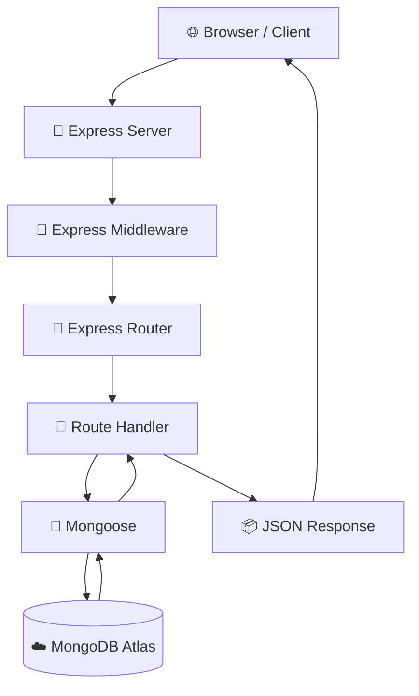
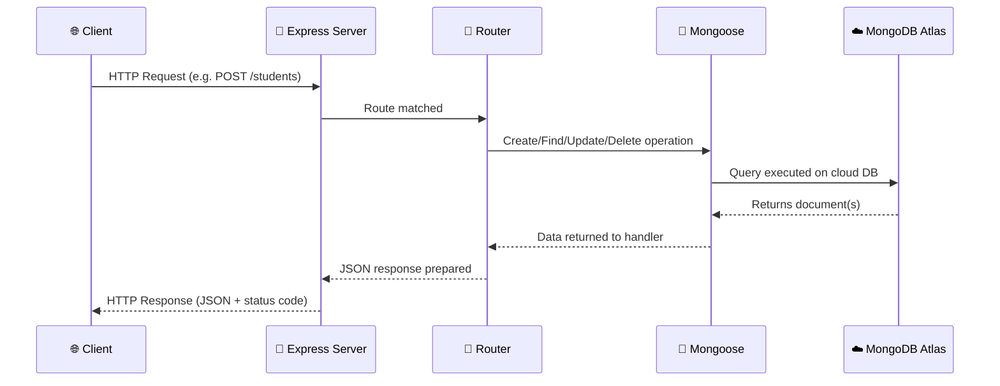
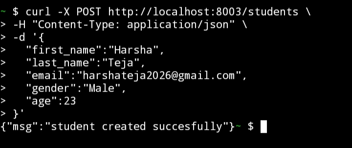
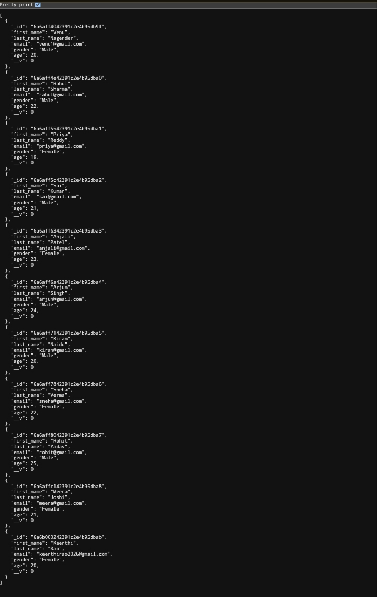
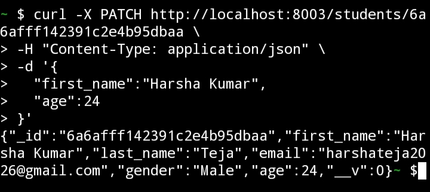
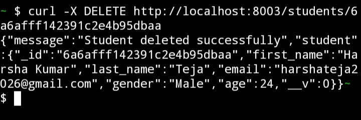

<div align="center">

# 🎓 Student CRUD API

### A Production-Ready RESTful Backend for Student Record Management

**Built with Node.js, Express.js, MongoDB Atlas & Mongoose**

<br/>


<br/>

[](https://nodejs.org/)
[](https://expressjs.com/)
[](https://www.mongodb.com/atlas)
[](https://mongoosejs.com/)
[](https://render.com/)
[](https://git-scm.com/)

<br/>

[](#)
[](#-contributing-guide)
[](#)

<br/>

**[🔴 Live Demo](https://student-api-bj2t.onrender.com/students)** • **[📂 Source Code](https://github.com/manisaimuralithatipelli/Web-development-/tree/main/student-api)** • **[📖 API Docs](#-api-documentation)**

</div>

---

## 📌 Introduction

**Student CRUD API** is a clean, production-grade RESTful backend service that manages student records through a full **Create, Read, Update, and Delete (CRUD)** system. It's built using **Node.js** and **Express.js** on the server side, with **MongoDB Atlas** as a cloud-hosted database and **Mongoose** as the Object Data Modeling (ODM) layer that connects the two.

This project follows real-world backend architecture patterns: a separated routing layer, a schema-based data model, environment-based configuration, and live cloud deployment. Whether you're a student learning backend development, a recruiter evaluating engineering fundamentals, or a developer looking for a clean CRUD reference implementation, this README explains every piece of the system in plain, beginner-friendly language.

> 💡 **Tip:** If you're new to backend development, don't skip the [Application Architecture](#-application-architecture) section — it explains *why* each technology was chosen, not just *how* to use it.

---

## 📚 Table of Contents

1. [About the Project](#-about-the-project)
2. [Features](#-features)
3. [Tech Stack](#-tech-stack)
4. [Application Architecture](#-application-architecture)
5. [Folder Structure](#-folder-structure)
6. [Request Flow Diagram](#-request-flow-diagram)
7. [Installation Guide](#-installation-guide)
8. [Environment Variables](#-environment-variables)
9. [Local Development Setup](#-local-development-setup)
10. [API Documentation](#-api-documentation)
11. [Error Handling](#-error-handling)
12. [HTTP Status Codes](#-http-status-codes-used)
13. [Deployment Guide](#-deployment-guide)
14. [Live Demo](#-live-demo)
15. [Testing with Postman](#-testing-using-postman)
16. [Security Notes](#-security-notes)
17. [Performance Notes](#-performance-notes)
18. [Best Practices Followed](#-best-practices-followed)
19. [Screenshots](#-screenshots)
20. [Contributing Guide](#-contributing-guide)
21. [Author](#-author)
22. [Contact](#-contact)
23. [GitHub Stats](#-github-stats)
24. [Star This Repository](#-star-this-repository)

---

## 📖 About the Project

The **Student CRUD API** exposes a set of HTTP endpoints that allow any client — a browser, a mobile app, Postman, or a frontend framework like React — to manage a collection of "student" records stored in the cloud. Each student record contains a first name, last name, email, gender, and age (defined by the Mongoose schema), and the API allows clients to:

- ➕ **Create** a new student record
- 📋 **Read** all students, or a single student by ID
- ✏️ **Update** an existing student's details
- ❌ **Delete** a student record permanently

All of this happens over standard **HTTP** using **JSON** as the data format, following **REST (Representational State Transfer)** conventions — the same architectural style used by companies like GitHub, Stripe, Twitter, and virtually every modern web API.

> ℹ️ **Note:** REST is not a framework or a library — it's a set of design conventions. This project follows those conventions closely: the resource (`/students`) is represented as a noun, and actions are represented using HTTP verbs (`GET`, `POST`, `PATCH`, `DELETE`).

---

## ✨ Features

- ✅ Full CRUD support (Create, Read, Update, Delete)
- ✅ RESTful endpoint design
- ✅ MongoDB Atlas cloud database integration
- ✅ Mongoose schema-based data modeling with field validation
- ✅ Unique email constraint at the database level
- ✅ Modular Express Router setup
- ✅ Environment-based configuration with `dotenv`
- ✅ Clean JSON request/response format
- ✅ Meaningful HTTP status codes for every scenario
- ✅ Production deployment on Render
- ✅ Scalable, professional folder structure

---

## 🛠 Tech Stack

<div align="center">

| Layer | Technology | Purpose |
|---|---|---|
| 🟢 Runtime | **Node.js** | Runs JavaScript on the server |
| ⚡ Framework | **Express.js** | Handles routing, requests, and responses |
| 🧭 Routing | **Express Router** | Organizes endpoints into modular files |
| 🍃 ODM | **Mongoose** | Maps JavaScript objects to MongoDB documents |
| 🍃 Database | **MongoDB Atlas** | Cloud-hosted NoSQL database |
| ☁️ Hosting | **Render** | Deploys and hosts the live API |
| 🔐 Config | **dotenv** | Loads secrets from `.env` safely |
| 📦 Package Manager | **npm** | Installs and manages dependencies |
| 🔧 Version Control | **Git & GitHub** | Tracks changes and hosts source code |

</div>

### Why each technology was chosen

- **Node.js** — A JavaScript runtime that lets us write server-side code using the same language as the frontend, with excellent performance for I/O-heavy operations like handling many simultaneous API requests.
- **Express.js** — A minimal, unopinionated web framework that sits on top of Node.js and makes it dramatically simpler to define routes, parse requests, and send responses, instead of writing raw HTTP-handling code from scratch.
- **Express Router** is used because it lets us **split routes into separate files** (`routes/studentRoutes.js`) instead of cramming every endpoint into `app.js`. This keeps the codebase organized and makes it easy to add new resources later without touching existing code.
- **Mongoose** is used because MongoDB by itself is "schema-less." Mongoose adds a **schema layer on top**, so we can define exactly what fields a `Student` should have (`first_name`, `last_name`, `email`, `gender`, `age`), their types, and validation rules — like requiring every field and enforcing a minimum `age` — catching bad data before it ever reaches the database.
- **MongoDB Atlas** is used instead of a local MongoDB installation because it's a **fully managed cloud database**. That means no manual server maintenance, automatic backups, built-in security, and the database is reachable from anywhere — essential once the app is deployed live on the internet.
- **dotenv** is used because sensitive values like the database connection string and port number should **never be hardcoded** into source code. `dotenv` loads these values from a local `.env` file into `process.env` at runtime, keeping secrets out of version control.
- **Render** is used as the hosting platform because it offers **free, simple, Git-based deployment** for Node.js APIs — every push to the connected GitHub branch can automatically redeploy the live application.

---

## 🏗 Application Architecture



**In plain English:**

1. A client (browser, Postman, frontend app) sends an HTTP request to the server.
2. **Express Server** receives the raw request.
3. **Middleware** (`express.json()`) parses incoming JSON into a usable JavaScript object.
4. **Express Router** looks at the URL and HTTP method to decide *which* piece of code should handle this request.
5. The matched **Route Handler** in `studentRoutes.js` runs the actual business logic (e.g., "create a new student").
6. **Mongoose** translates that logic into a database operation via the `Student` model.
7. **MongoDB Atlas** stores or retrieves the actual data in the cloud.
8. The result travels back up the chain and is sent to the client as a **JSON response**.

---

## 📂 Folder Structure

```
student-api/
│
├── app.js                    # Entry point — starts the Express server & connects to MongoDB
├── package.json               # Project metadata & dependency list
├── package-lock.json          # Exact locked versions of installed dependencies
├── .env                       # Environment variables (MONGO_URI, PORT) — never committed to Git
│
├── model/
│   └── model.js                # Mongoose schema — defines the shape of a "Student" document
│
└── routes/
    └── studentRoutes.js         # Express Router — defines all /students endpoints
```

### What each part does

| File / Folder | Purpose |
|---|---|
| `app.js` | Boots up the Express app, connects to MongoDB Atlas, and mounts the routes |
| `model/model.js` | Defines the **Mongoose Schema** — the "blueprint" for what a student record looks like |
| `routes/studentRoutes.js` | Contains the actual **CRUD logic** for each endpoint (`POST`, `GET`, `PATCH`, `DELETE`) |
| `.env` | Stores `MONGO_URI` and `PORT` securely, outside of source code |
| `package.json` | Lists dependencies (`express`, `mongoose`, `dotenv`) and npm scripts |

> 📝 **Note:** Separating `model/` and `routes/` is a foundational backend pattern. As the app grows, you could add `controllers/` or `middleware/` folders without restructuring what already exists.

---

## 🔄 Request Flow Diagram



This diagram shows exactly how a single request — for example, creating a new student — travels through every layer of the application and back, end to end.

---

## ⚙️ Installation Guide

### Prerequisites

Make sure you have the following installed:

- [Node.js](https://nodejs.org/) (v16 or higher recommended)
- [npm](https://www.npmjs.com/) (comes bundled with Node.js)
- A free [MongoDB Atlas](https://www.mongodb.com/cloud/atlas/register) account
- [Git](https://git-scm.com/)

### Clone the Repository

```bash
git clone https://github.com/manisaimuralithatipelli/Web-development-.git
cd Web-development-/student-api
```

### Install Dependencies

```bash
npm install
```

This reads `package.json` and installs `express`, `mongoose`, and `dotenv` into a local `node_modules/` folder.

---

## 🔑 Environment Variables

Create a `.env` file in the root of the `student-api` folder:

```env
MONGO_URI=your_mongodb_atlas_connection_string_here
PORT=8003
```

| Variable | Description |
|---|---|
| `MONGO_URI` | The full MongoDB Atlas connection string, including username, password, and database name |
| `PORT` | The port the Express server listens on (defaults to `8003` if not set) |

> 🚨 **Warning:** Never commit your `.env` file to GitHub. Add it to `.gitignore` immediately. Treat your `MONGO_URI` like a password — anyone with it has full access to your database.

---

## 💻 Local Development Setup

1. Complete the [Installation Guide](#-installation-guide) above.
2. Set up your `.env` file with a valid `MONGO_URI` and `PORT`.
3. Start the server:

```bash
node app.js
```

Or, if a dev script is configured with a tool like `nodemon`:

```bash
npm run dev
```

4. The server should now be running locally (e.g., `http://localhost:8003`).
5. Test it by visiting `http://localhost:8003/students` in your browser or Postman.

> 💡 **Tip:** Use [nodemon](https://www.npmjs.com/package/nodemon) during development — it automatically restarts the server whenever you save a file, saving you from manually restarting `node app.js` every time.

---

## 📡 API Documentation

**Base URL (Live):** `https://student-api-bj2t.onrender.com`
**Base URL (Local):** `http://localhost:8003`

### Endpoint Table

| Method | Endpoint | Description |
|---|---|---|
| `POST` | `/students` | Create a new student |
| `GET` | `/students` | Retrieve all students |
| `GET` | `/students/:id` | Retrieve a single student by ID |
| `PATCH` | `/students/:id` | Update an existing student by ID |
| `DELETE` | `/students/:id` | Delete a student by ID |

---

### ➕ Create Student

**`POST /students`**

Creates a new student document in the database.

**Request Body:**

```json
{
  "first_name": "Rahul",
  "last_name": "Sharma",
  "email": "rahul.sharma@example.com",
  "gender": "Male",
  "age": 21
}
```

**cURL Example:**

```bash
curl -X POST https://student-api-bj2t.onrender.com/students \
  -H "Content-Type: application/json" \
  -d '{"first_name": "Rahul", "last_name": "Sharma", "email": "rahul.sharma@example.com", "gender": "Male", "age": 21}'
```

**Success Response — `201 Created`:**

```json
{
  "msg": "student created succesfully"
}
```

---

### 📋 Read All Students

**`GET /students`**

Retrieves every student currently stored in the database.

**cURL Example:**

```bash
curl https://student-api-bj2t.onrender.com/students
```

**Success Response — `200 OK`:**

```json
[
  {
    "_id": "6a6851a2e2724abdb176fb35",
    "first_name": "Rahul",
    "last_name": "Sharma",
    "email": "rahul.sharma@example.com",
    "gender": "Male",
    "age": 21
  }
]
```

---

### 🔍 Read Single Student

**`GET /students/:id`**

Retrieves a single student by their unique MongoDB `_id`.

**cURL Example:**

```bash
curl https://student-api-bj2t.onrender.com/students/6a6851a2e2724abdb176fb35
```

**Success Response — `200 OK`:**

```json
{
  "_id": "6a6851a2e2724abdb176fb35",
  "first_name": "Rahul",
  "last_name": "Sharma",
  "email": "rahul.sharma@example.com",
  "gender": "Male",
  "age": 21
}
```

---

### ✏️ Update Student

**`PATCH /students/:id`**

Updates one or more fields of an existing student.

**Request Body:**

```json
{
  "age": 22
}
```

**cURL Example:**

```bash
curl -X PATCH https://student-api-bj2t.onrender.com/students/6a6851a2e2724abdb176fb35 \
  -H "Content-Type: application/json" \
  -d '{"age": 22}'
```

**Success Response — `200 OK`:**

```json
{
  "_id": "6a6851a2e2724abdb176fb35",
  "first_name": "Rahul",
  "last_name": "Sharma",
  "email": "rahul.sharma@example.com",
  "gender": "Male",
  "age": 21
}
```

> 📝 **Note:** `findByIdAndUpdate` returns the document *before* the update is applied by default in Mongoose, unless the `{ new: true }` option is passed.

---

### ❌ Delete Student

**`DELETE /students/:id`**

Permanently removes a student from the database.

**cURL Example:**

```bash
curl -X DELETE https://student-api-bj2t.onrender.com/students/6a6851a2e2724abdb176fb35
```

**Success Response — `200 OK`:**

```json
{
  "message": "Student deleted successfully",
  "student": {
    "_id": "6a6851a2e2724abdb176fb35",
    "first_name": "Rahul",
    "last_name": "Sharma",
    "email": "rahul.sharma@example.com",
    "gender": "Male",
    "age": 21
  }
}
```

---

## 🛑 Error Handling

The API returns structured JSON error messages so clients can handle failures gracefully instead of receiving raw stack traces.

```json
{
  "msg": "Descriptive error message here"
}
```

Common error scenarios handled:

| Scenario | Status Code | Example Message |
|---|---|---|
| Duplicate email (unique constraint violated) | `500` | `"E11000 duplicate key error"` |
| Missing required field (`first_name`, `email`, etc.) | `500` | `"Student validation failed"` |
| Age below the minimum allowed value | `500` | `"Path 'age' is below minimum"` |
| Database connection failure | `500` | `"Internal server error"` |

> ℹ️ **Note:** In a production-grade upgrade of this project, you'd add input validation (e.g., with `Joi` or `express-validator`) to catch bad requests with a `400 Bad Request` *before* they ever reach the database, and return a `404 Not Found` explicitly when a requested student `id` doesn't exist.

---

## 📟 HTTP Status Codes Used

| Code | Meaning | When It's Used |
|---|---|---|
| `200` | OK | Successful `GET`, `PATCH`, or `DELETE` |
| `201` | Created | A new student was successfully created via `POST` |
| `500` | Internal Server Error | Validation failure, duplicate email, or unexpected server/database error |

---

## 🚀 Deployment Guide

This API is deployed on **[Render](https://render.com/)**, a cloud platform for hosting web services directly from a GitHub repository.

### Steps to deploy your own copy:

1. Push your project to a GitHub repository.
2. Create a free account at [render.com](https://render.com/).
3. Click **New → Web Service** and connect your GitHub repo.
4. Set the **Build Command**: `npm install`
5. Set the **Start Command**: `node app.js`
6. Add your environment variables `MONGO_URI` and `PORT` in Render's dashboard under **Environment**.
7. Click **Deploy** — Render will build and host your API automatically.
8. Every future `git push` to your connected branch triggers an automatic redeploy.

> 💡 **Tip:** Render's free tier may "spin down" after periods of inactivity, so the first request after idle time can take a few extra seconds to respond — this is expected behavior, not a bug.

---

## 🔴 Live Demo

The API is live and publicly accessible here:

🔗 **[https://student-api-bj2t.onrender.com/students](https://student-api-bj2t.onrender.com/students)**

Visit the link above or use the [cURL examples](#-api-documentation) to interact with the live database directly.

---

## 🧪 Testing Using Postman

1. Open [Postman](https://www.postman.com/downloads/).
2. Create a new request.
3. Set the method (`GET`, `POST`, `PATCH`, `DELETE`) and URL, e.g. `https://student-api-bj2t.onrender.com/students`.
4. For `POST`/`PATCH` requests, go to the **Body** tab → select **raw** → choose **JSON** → enter your payload.
5. Click **Send** and inspect the response body and status code.

> 📝 **Note:** You can also test directly from a mobile terminal (Termux, iSH, Termius) using the `curl` examples in the [API Documentation](#-api-documentation) section above.

---

## 🔒 Security Notes

- 🔐 `.env` file is excluded from version control via `.gitignore` to protect the `MONGO_URI` secret.
- 🌐 MongoDB Atlas restricts access via IP allow-listing and authenticated connection strings.
- 📧 The `email` field has a `unique: true` constraint at the schema level, preventing duplicate student records with the same email.
- ⚠️ This project does **not** currently implement authentication/authorization (e.g., JWT) — all endpoints are publicly accessible. This is intentional for learning purposes but should be added before handling real student data.
- ⚠️ Input validation currently relies on Mongoose schema rules only; a dedicated validation library is recommended for production use.

---

## ⚡ Performance Notes

- Mongoose connection pooling is used by default, allowing efficient reuse of database connections across requests.
- MongoDB Atlas's cloud infrastructure provides built-in redundancy and automatic scaling of storage.
- For high-traffic scenarios, consider adding an index on the `email` field to speed up uniqueness checks and lookups.

---

## ✅ Best Practices Followed

- ✔️ Separation of concerns (routes vs. model vs. server entry point)
- ✔️ Environment-based configuration (no hardcoded secrets)
- ✔️ RESTful, resource-based endpoint naming
- ✔️ Consistent JSON response format
- ✔️ Schema-level field validation (`required`, `unique`, `min`)
- ✔️ Cloud-first database design
- ✔️ Git-based deployment workflow

---

## 📸 Screenshots

<div align="center">

**`POST /students` — Create Student**



<br/><br/>

**`GET /students` — All Students**



<br/><br/>

**`PATCH /students/:id` — Update Student**



<br/><br/>

**`DELETE /students/:id` — Delete Student**



</div>

> 📝 **Note:** These screenshots were captured using `curl` from a mobile terminal, showing real requests hitting the live deployed API on Render.

---

## 🤝 Contributing Guide

Contributions are welcome and appreciated! To contribute:

1. **Fork** this repository
2. **Clone** your fork: `git clone https://github.com/your-username/Web-development-.git`
3. Create a new branch: `git checkout -b feature/your-feature-name`
4. Make your changes and commit: `git commit -m "Add: your feature description"`
5. Push to your fork: `git push origin feature/your-feature-name`
6. Open a **Pull Request** describing your changes

> 💡 **Tip:** For major changes, please open an issue first to discuss what you'd like to change.

---

## 👤 Author

**Mani Sai Murali Thatipelli**

- GitHub: [@manisaimuralithatipelli](https://github.com/manisaimuralithatipelli)
- Email: [manisaimuralithatipelli1@gmail.com](mailto:manisaimuralithatipelli1@gmail.com)
- Repository: [Web-development-](https://github.com/manisaimuralithatipelli/Web-development-/tree/main/student-api)

---

## 📬 Contact

Have questions, feedback, or found a bug? Reach out through:

- 📧 **Email:** [manisaimuralithatipelli1@gmail.com](mailto:manisaimuralithatipelli1@gmail.com)
- 🐙 **GitHub Issues:** [Open an Issue](https://github.com/manisaimuralithatipelli/Web-development-/issues)
- 🔀 **Pull Requests:** [Contribute Here](https://github.com/manisaimuralithatipelli/Web-development-/pulls)

---

## 📊 GitHub Stats

<div align="center">


</div>

---

## 🌟 Star This Repository

<div align="center">

If this project helped you learn something or inspired your own backend build, please consider giving it a ⭐!

**[⭐ Star this repo on GitHub](https://github.com/manisaimuralithatipelli/Web-development-)**

</div>

---

<div align="center">

### 🛠 Built with Node.js, Express.js & MongoDB Atlas

**[Mani Sai Murali Thatipelli](https://github.com/manisaimuralithatipelli)**

<sub>© 2026 Student CRUD API</sub>

</div>
