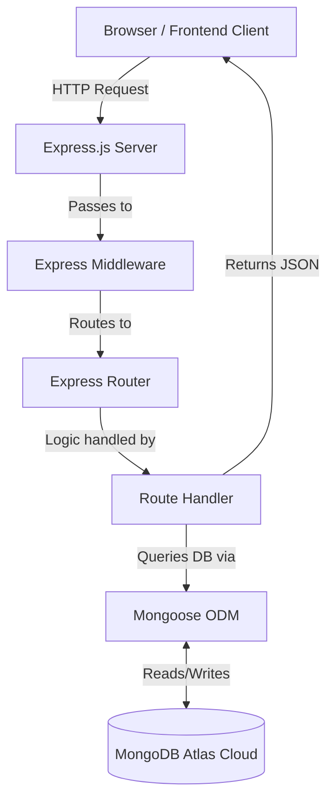

<div align="center">
# 🚀 User CRUD API

**A professional, production-ready RESTful backend application built with Node.js, Express.js, and MongoDB.**

<br />
Node.js

Express.js

MongoDB

Render

License: MIT
Live Demo • Report Bug • Request Feature
</div>
## 👋 Professional Introduction
Welcome to the **User CRUD API**! Whether you are a recruiter, a fellow developer, or a student learning backend architecture, this repository demonstrates industry-standard practices in building RESTful APIs. This project provides a robust foundation for managing user data operations (Create, Read, Update, Delete) utilizing the power of JavaScript on the server side.
This repository is designed to be highly readable, scalable, and beginner-friendly, heavily commenting on the *why* behind architectural decisions.
## 📑 Table of Contents
 * About the Project
 * Why this Project
 * Features
 * Technology Stack
 * Architecture & Flow
 * Project Structure
 * Getting Started (Installation)
 * API Documentation
 * Deployment Guide
 * Best Practices & Security
 * Learning Outcomes
 * Screenshots
 * FAQ
 * Contributing
 * License & Contact
## 🔍 About the Project
The **User CRUD API** is a backend application that serves as the communication bridge between a client application (like a React or Angular frontend) and a database. Built entirely in JavaScript, it leverages Node.js for server execution, Express.js for routing, and MongoDB Atlas for cloud data storage.
> 💡 **What is an API?** An Application Programming Interface (API) allows different software applications to talk to each other. In this case, our API listens for HTTP requests and responds with JSON data.
> 
## 🎯 Why this Project?
This project was built to master professional backend development. While building a simple API is easy, building an API that is modular, secure, and production-ready requires a deep understanding of software design patterns.
**Goals of this project:**
 * Understand REST API principles and HTTP methods.
 * Implement the MVC (Model-View-Controller) pattern using Routes and Models.
 * Learn to interact with NoSQL databases securely.
 * Master deployment workflows using modern Cloud PaaS (Platform as a Service).
## ✨ Features
 * **Create User:** Add new users to the database with data validation.
 * **Read All Users:** Retrieve a list of all registered users.
 * **Read Single User:** Fetch a specific user by their unique database ID.
 * **Update User:** Modify existing user information (Partial or Full updates).
 * **Delete User:** Permanently remove a user from the database.
 * **Cloud Database:** Seamless integration with MongoDB Atlas.
 * **Modular Routing:** Clean codebase utilizing Express Router.
 * **Environment Variables:** Secure credential management.
 * **Standardized Responses:** Predictable JSON responses with proper HTTP Status Codes.
## 🛠️ Technology Stack
Every technology in this project was chosen for a specific reason. Here is a beginner-friendly breakdown:
| Technology | Role | Why we use it |
|---|---|---|
| **Node.js** | Runtime Environment | Allows us to run JavaScript on the server instead of just in the browser. |
| **Express.js** | Web Framework | Makes creating server routes and handling HTTP requests incredibly fast and easy. |
| **Express Router** | Routing Module | Separates our routes (endpoints) into different files, keeping our application modular and organized. |
| **MongoDB Atlas** | Cloud Database | A fully managed NoSQL cloud database. It stores our user data permanently in the cloud. |
| **Mongoose ODM** | Database Modeling | Acts as a translator between JavaScript objects and MongoDB. It provides strict schemas (rules) for our data. |
| **dotenv** | Environment Manager | Keeps sensitive information (like database passwords) hidden from GitHub by loading them from a local .env file. |
| **Render** | Cloud Hosting | A platform that automatically builds and deploys our application to the internet every time we push to GitHub. |
## 🏗️ Application Architecture
Our application follows a standard Client-Server architecture.

## 📁 Project Structure
A scalable folder structure is crucial for enterprise applications. Here is how this project is organized:
```text
user-crud-api/
├── app.js               # Entry point of the application. Starts the server.
├── package.json         # Lists all project dependencies and scripts.
├── package-lock.json    # Locks down exact versions of dependencies.
├── .env                 # (Hidden) Stores private environment variables.
├── models/              # Contains database schemas.
│   └── user.js          # Defines what a "User" looks like (Name, Email, etc.).
└── routes/              # Contains the API endpoints.
    └── user.js          # Handles all /users routes (GET, POST, PATCH, DELETE).

```
 * **Why models and routes folders?** Separation of Concerns. The routes folder handles the *web traffic*, while the models folder handles the *data logic*. This prevents messy, unreadable code.
## 🔄 How a Request Travels
Let's understand what happens when a user requests data:
 1. **The Request:** A client (like Postman or a Web Browser) sends an HTTP GET request to https://user-crud-api-xzes.onrender.com/users.
 2. **The Server:** app.js receives the request. Because it matches /users, it forwards the request to the routes/user.js file.
 3. **The Router:** The Express Router catches the GET / request and executes a callback function.
 4. **The Database Query:** Inside the function, Mongoose is instructed to find all users (User.find()).
 5. **The Cloud:** Mongoose sends this query securely over the internet to MongoDB Atlas.
 6. **The Response:** MongoDB Atlas returns the data to Mongoose. The Route Handler wraps this data in a JSON object and sends it back to the client with a 200 OK status code.
## 💻 Local Development Setup
Follow these steps to run this project on your local machine.
### Prerequisites
Make sure you have the following installed:
 * Node.js (v14 or higher)
 * Git
 * A MongoDB Atlas account (or local MongoDB installed)
### 1. Clone the Repository
```bash
git clone https://github.com/manisaimuralithatipelli/Web-development-.git
cd Web-development-/user-crud-api

```
### 2. Install Dependencies
```bash
npm install

```
> **Note:** npm install reads the package.json file and downloads tools like Express and Mongoose into a node_modules folder.
> 
### 3. Setup Environment Variables
Create a file named .env in the root of your project directory (user-crud-api/.env) and add your MongoDB connection string:
| Variable | Description | Example |
|---|---|---|
| MONGO_URI | Your MongoDB Atlas Connection String | mongodb+srv://<username>:<password>@cluster0.mongodb.net/myDatabase |
| PORT | The port the server will run on | 3000 |
### 4. Start the Development Server
```bash
npm start

```
You should see a message in your terminal: Server running on port 3000 and Connected to MongoDB.
## 📖 API Documentation
The API accepts and returns **JSON** formatted data.
### Base URL
 * **Local:** http://localhost:3000
 * **Production:** https://user-crud-api-xzes.onrender.com
### Endpoints Overview
| HTTP Method | Endpoint | Action | Description |
|---|---|---|---|
| **POST** | /users | Create | Creates a new user in the database. |
| **GET** | /users | Read | Retrieves a list of all users. |
| **GET** | /users/:id | Read | Retrieves a specific user by their unique id. |
| **PATCH** | /users/:id | Update | Updates specific fields of an existing user. |
| **DELETE** | /users/:id | Delete | Removes a user from the database. |
### Request Examples
**Creating a User (POST /users) or Updating a User (PATCH /users/:id)**
Send a JSON payload in the body of your request:
```json
{
  "name": "Jane Doe",
  "email": "jane.doe@example.com",
  "age": 28,
  "role": "Developer"
}

```
### Response Examples
**Success Response (200 OK or 201 Created)**
```json
{
  "status": "success",
  "data": {
    "_id": "64a7b9c9f1a2b3c4d5e6f7a8",
    "name": "Jane Doe",
    "email": "jane.doe@example.com",
    "age": 28,
    "role": "Developer",
    "createdAt": "2023-07-06T12:00:00.000Z",
    "updatedAt": "2023-07-06T12:00:00.000Z",
    "__v": 0
  }
}

```
### cURL Examples
Test the API directly from your terminal!
**Get all users:**
```bash
curl -X GET https://user-crud-api-xzes.onrender.com/users

```
**Create a user:**
```bash
curl -X POST https://user-crud-api-xzes.onrender.com/users \
-H "Content-Type: application/json" \
-d '{"name":"John", "email":"john@test.com", "age":30}'

```
## ⚠️ Error Handling & Status Codes
This API uses standard HTTP status codes to indicate the success or failure of an API request. Errors are returned in a clean JSON format.
**Error Response Example:**
```json
{
  "message": "User not found"
}

```
| Status Code | Name | What it means |
|---|---|---|
| **200** | OK | The request was successful (Used for GET, PATCH, DELETE). |
| **201** | Created | The request was successful and a new resource was created (Used for POST). |
| **400** | Bad Request | The request was invalid (e.g., missing required fields like email). |
| **404** | Not Found | The requested resource (id) could not be found in the database. |
| **500** | Internal Server Error | Something went wrong on the server side (e.g., database connection lost). |
## 🚀 Deployment Guide
This application is deployed on **Render**, a modern cloud hosting platform.
**Why Render?**
Render automatically connects to GitHub. Whenever new code is pushed to the main branch, Render automatically detects the changes, runs npm install, and restarts the server. It handles HTTPS encryption and server maintenance automatically.
**Live API Link:** https://user-crud-api-xzes.onrender.com/users
## 🧪 Testing using Postman
Postman is a popular tool for testing APIs without building a frontend interface.
 1. Download and open Postman.
 2. Create a new Request.
 3. Select the HTTP Method (e.g., GET).
 4. Enter the URL: https://user-crud-api-xzes.onrender.com/users.
 5. Click **Send**.
 6. View the JSON response in the lower pane.
 7. To test POST or PATCH, go to the **Body** tab, select **raw** and **JSON**, and paste the Request Body Example from above before clicking Send.
## 🛡️ Security & Performance Notes
Building a production-ready API means thinking about scale and safety.
 * **Environment Variables:** Credentials are kept secure using dotenv. The MONGO_URI is never committed to GitHub.
 * **Mongoose Validation:** The database schema enforces data types (e.g., age must be a number) and required fields, preventing malicious or malformed data from being saved.
 * **JSON Parsing:** Express's built-in express.json() middleware safely parses incoming data payloads.
 * **Connection Pooling:** Mongoose automatically manages connection pools to MongoDB Atlas, ensuring efficient database queries even under heavy load.
## 🏆 Best Practices Followed
 1. **RESTful Naming Conventions:** Endpoints use nouns (/users) not verbs (/getUsers), relying on HTTP methods for action context.
 2. **Separation of Concerns:** Routing logic and database logic are strictly separated.
 3. **Semantic Status Codes:** Returning correct HTTP codes helps client applications handle responses properly.
 4. **Clean Code:** Extensively commented, consistently formatted, and neatly structured code.
## 🧠 Learning Outcomes
By completing and documenting this project, the following skills were solidified:
 * Designing and implementing scalable REST APIs.
 * Interacting with NoSQL databases using an Object Data Modeling (ODM) library.
 * Managing asynchronous JavaScript operations (async/await, Promises).
 * Utilizing Postman for comprehensive API testing.
 * Implementing continuous deployment workflows via Render and GitHub.
## 🔮 Future Improvements
While this API is production-ready for basic CRUD, future iterations could include:
 * [ ] **Authentication & Authorization:** Implementing JWT (JSON Web Tokens) to secure routes.
 * [ ] **Pagination:** Limiting the GET /users route to return 10 users at a time.
 * [ ] **Data Validation:** Adding libraries like Joi or Zod for stricter request body validation.
 * [ ] **Rate Limiting:** Protecting the API from DDoS attacks using express-rate-limit.
## 📸 Screenshots
| Postman GET Request | MongoDB Atlas Dashboard |
|---|---|
|  |  |
> *Note: Placeholder images used. Replace with actual screenshots of your Postman workspace and MongoDB collections.*
> 
## ❓ FAQ
**Q: I am getting a 500 Internal Server Error when running locally. Why?** A: This usually means your server cannot connect to MongoDB. Check that your MONGO_URI in the .env file is correct and that you have whitelisted your IP address in the MongoDB Atlas Network Access settings.
**Q: Why use PATCH instead of PUT for updates?** A: PUT is meant to completely replace an entire resource. PATCH is used to partially update a resource (e.g., just changing a user's email). This is a standard REST convention.
## 🤝 Contributing
Contributions make the open-source community an amazing place to learn, inspire, and create. Any contributions you make are **greatly appreciated**.
 1. Fork the Project
 2. Create your Feature Branch (git checkout -b feature/AmazingFeature)
 3. Commit your Changes (git commit -m 'Add some AmazingFeature')
 4. Push to the Branch (git push origin feature/AmazingFeature)
 5. Open a Pull Request
## 📜 License
Distributed under the MIT License. See LICENSE for more information.
## 👤 Author
**Mani Sai Murali Thatipelli**
 * GitHub: @manisaimuralithatipelli
## 📬 Contact
Project Link: https://github.com/manisaimuralithatipelli/Web-development-/tree/main/user-crud-api
## 📊 Repository Stats
<div align="center">

</div>
## ⭐ Show your support
If you found this repository helpful, educational, or used it as a reference for your own project, please give it a **Star** ⭐️! It helps others discover the project.
<div align="right">
<a href="#-user-crud-api">⬆️ Back to Top</a>
</div>
 